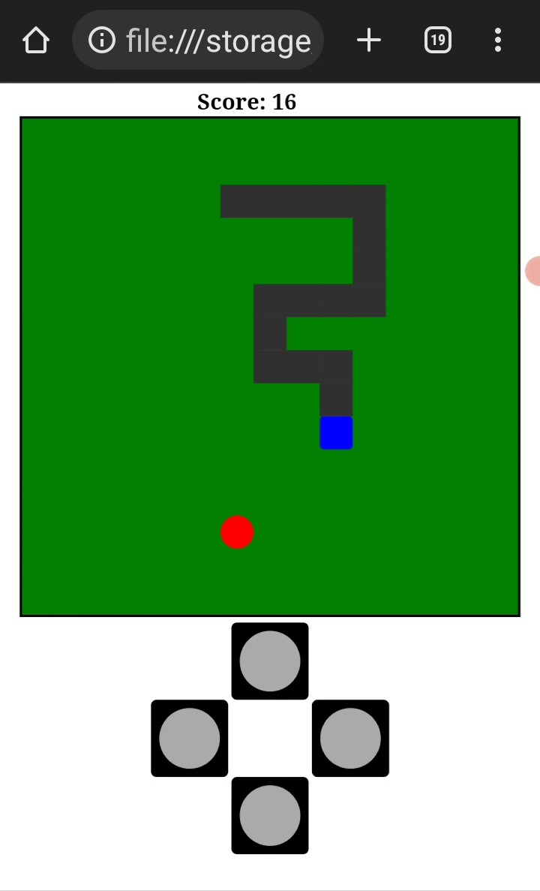

# snake-game-JS

This is a 2D snake game I built using JavaScript.  It's very similar to the Snake Mania Game I built before using Python's Pygame module.  
The key idea i used was `setInterval(function, duration, **kwags)`.  The setInterval method acts like a while loop.
Once the window loads and the game starts,  event handlers are set on each button.  When a button is clicked it triggers the handler which calls a function that creates a setInterval method and passes it the direction of the snake as an argument.  
The setInterval now calls on a function every 220 milliseconds,  and that function calls on other helper functions that are responsible  for  updating  the position of the snake and  food,  checking for collisions  and also checking for changes in the state of the game.
If another button is clicked, its event handler is triggered and  the previous setInterval methods are cleared and a new one is created and passed the new direction of the snake as an argument. And so it goes on.....  

**Demo picture**
 

You can play the game at [Snake Mania JS](https://snake-mania-js.herokuapp.com)    
